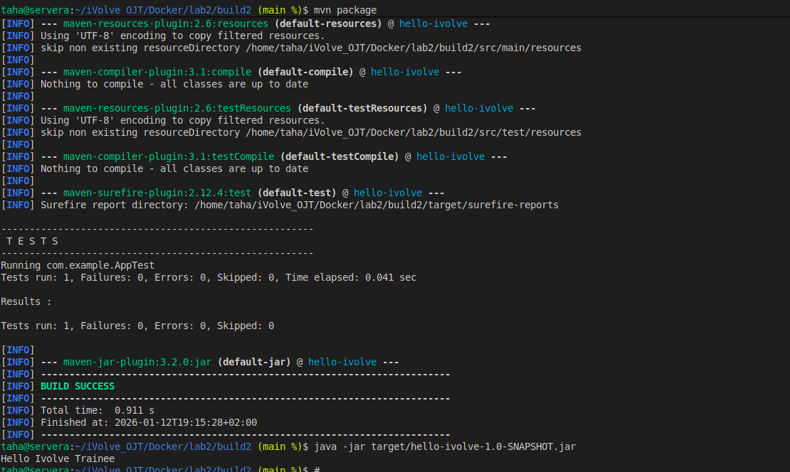

# Lab2: Building and Testing a Java Application with Maven

This task demonstrates how to build, test, and run a Java application using **Apache Maven**.
All steps are written to be executed directly from the terminal using **Bash**.

---

## Prerequisites

* Linux / WSL environment
* Java 17 installed

Verify Java installation:

```bash
java -version
```

---

## Step 1: Install Maven

```bash
sudo apt update
sudo apt install maven -y
```

Verify installation:

```bash
mvn -v
```

---

## Step 2: Clone the Application Source Code

```bash
git clone https://github.com/Ibrahim-Adel15/build2.git
cd build2
```

---

## Step 3: Run Unit Tests

```bash
mvn test
```

This step validates the application logic before packaging.

---

## Step 4: Build the Application

```bash
mvn package
```

Generated artifact:

```text
target/hello-ivolve-1.0-SNAPSHOT.jar
```

---

## Step 5: Run the Application

```bash
java -jar target/hello-ivolve-1.0-SNAPSHOT.jar
```

---

>## Screenshot (Lab2 Execution Result)

---


## Author

Mohamed Ahmed Mohamed Taha
