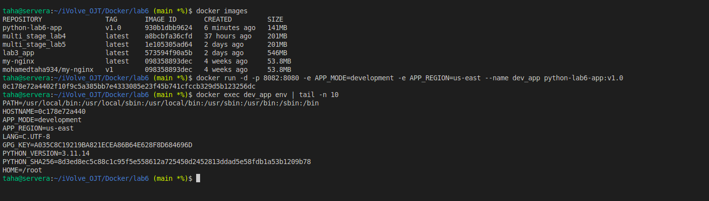
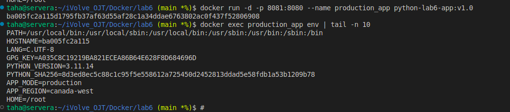
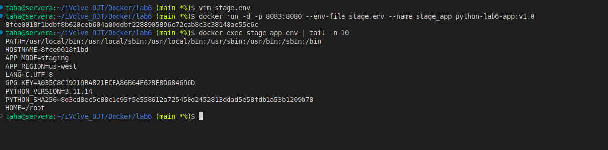

# Lab 6: Managing Docker Environment Variables Across Build and Runtime

This lab demonstrates how to manage Docker environment variables across **build time** and **runtime** using three different methods:

* Command-line variables
* Environment file
* Dockerfile `ENV`

---

##  Requirements

* Docker installed
* Git installed

---

## Clone the Application Code

```bash
git clone https://github.com/Ibrahim-Adel15/Docker-3.git
cd Docker-3
```

---

## Dockerfile

The following Dockerfile uses a Python image, installs Flask, exposes port 8080, and defines default environment variables for production.

```dockerfile
FROM python:3.11-slim 

WORKDIR /lab6

RUN pip install flask

COPY ./Docker-3/app.py . 

ENV APP_MODE=production

ENV APP_REGION=canada-west

EXPOSE 8080

CMD [ "python", "app.py" ]
```

---

##  Build Docker Image

```bash
docker build -t python-lab6-app .
```

---

##  Run Containers with Different Environment Variable Methods

### 1 Using Command-Line Variables (development / us-east)

```bash
docker run -d \
  -p 8081:8080 \
  -e APP_MODE=development \
  -e APP_REGION=us-east \
  --name dev_app \
  python-lab6-app
```

---

### 2 Using Environment File (staging / us-west)

#### Create environment file

```bash
vi stage.env
```

```env
APP_MODE=staging
APP_REGION=us-west
```

#### Run container

```bash
docker run -d \
  -p 8082:8080 \
  --env-file stage.env \
  --name stage_app \
  python-lab6-app
```

---

### 3 Using Dockerfile ENV (production / canada-west)

```bash
docker run -d \
  -p 8083:8080 \
  --name production_app \
  python-lab6-app
```

---

##  Verification

```bash
docker exec production_app env | tail -n 10
docker exec dev_app env | tail -n 10
docker exec stage_app env | tail -n 10
```

---

>## Screenshot (Lab6 Execution Result)








---


## Author

Mohamed Ahmed Mohamed Taha
