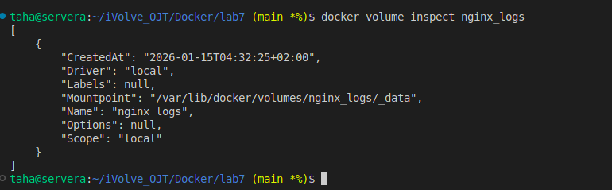
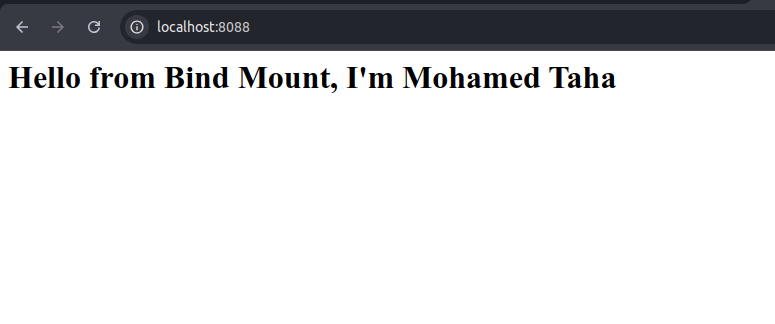
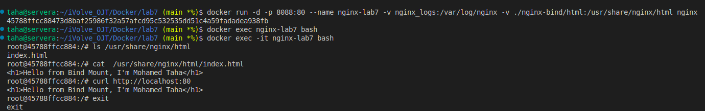

# Lab 7: Docker Volume and Bind Mount with Nginx

## Objective

This lab demonstrates how to use Docker Volumes and Bind Mounts to persist Nginx logs and serve HTML from the host machine.

---

## Requirements

* Docker installed
* Nginx image available

---

## 1. Create Docker Volume for Nginx Logs

```bash
docker volume create nginx_logs
```
---

## 2. Create Bind Mount Directory on Host

```bash
mkdir -p nginx-bind/html
```
---

## 3. Create index.html

```bash
vi nginx-bind/html/index.html
```

```html
<h1>Hello from Bind Mount</h1>
```

---

## 4. Run Nginx Container with Volume and Bind Mount

```bash

docker run -d -p 8080:80 --name nginx-lab7 -v nginx_logs:/var/log/nginx -v ./nginx-bind/html:/usr/share/nginx/html nginx
```

---

## 5. Verify Nginx Page

```bash
curl http://localhost:8080
```

---


>## Screenshot (Lab7 Execution Result)








---

## 8. Stop and Remove Container

```bash
docker stop nginx-lab7
docker rm nginx-lab7
```

---

## 9. Delete the Volume

```bash
docker volume rm nginx_logs
```

### Verify deletion

```bash
docker volume ls
```

---

## Author

Mohamed Ahmed Mohamed Taha
