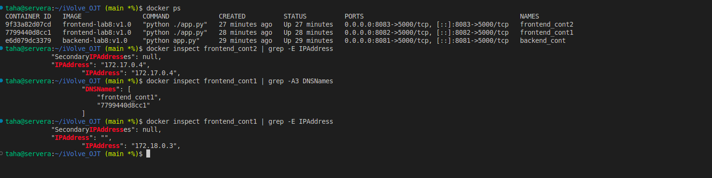
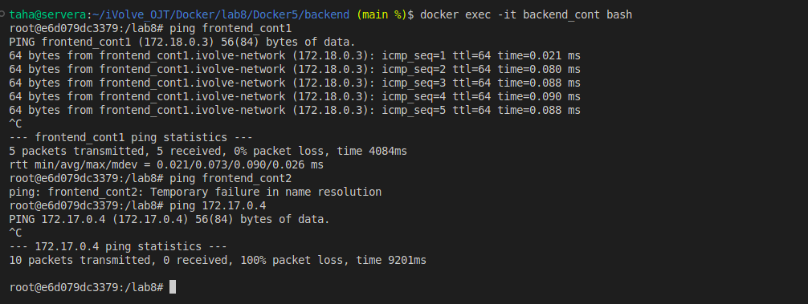

# Lab 8: Custom Docker Network for Microservices

## Objective
This lab demonstrates how to use Docker custom networks to enable communication between microservices containers using container names instead of IP addresses.

---

## Prerequisites
- Docker
- Git

---

## Step 1: Clone the Repository
```bash
git clone https://github.com/Ibrahim-Adel15/Docker5.git
cd Docker5
```

---

## Step 2: Frontend Dockerfile
Create a Dockerfile for the frontend service.

```dockerfile
FROM python:3.11-slim

WORKDIR /lab8

COPY . .

RUN pip install -r requirements.txt

EXPOSE 5000

CMD ["python", "./app.py"]
```

Build the frontend image:
```bash
docker build -t frontend-lab8:v1.0 .
```

---

## Step 3: Backend Dockerfile
Create a Dockerfile for the backend service.

```dockerfile
FROM python:3.11-slim

WORKDIR /lab8

RUN pip install flask

COPY ./app.py .

EXPOSE 5000

CMD ["python", "app.py"]
```

Build the backend image:
```bash
docker build -t backend-lab8:v1.0 .
```

---

## Step 4: Create Custom Network
```bash
docker network create ivolve-network
```

---

## Step 5: Run Containers

Run backend container using custom network:
```bash
docker run -d --name backend_cont --network ivolve-network -p 8081:5000 backend-lab8:v1.0
```

Run frontend container (frontend1) using custom network:
```bash
docker run -d --name frontend_cont1 --network ivolve-network -p 8082:5000 frontend-lab8:v1.0
```

Run another frontend container (frontend2) using default network:
```bash
docker run -d --name frontend_cont2 -p 8083:5000 frontend-lab8:v1.0
```

---

## Step 6: Verify Communication

From frontend1:
```bash
ping backend_cont
```

From frontend2:
```bash
ping backend_cont
```

Expected result:
- frontend1 can communicate with backend
- frontend2 cannot communicate with backend using container name

---

>## Screenshot (Lab8 Execution Result)






---

## Step 7: Delete Custom Network
```bash
docker network rm ivolve-network
```

---
## Author

Mohamed Ahmed Mohamed Taha
