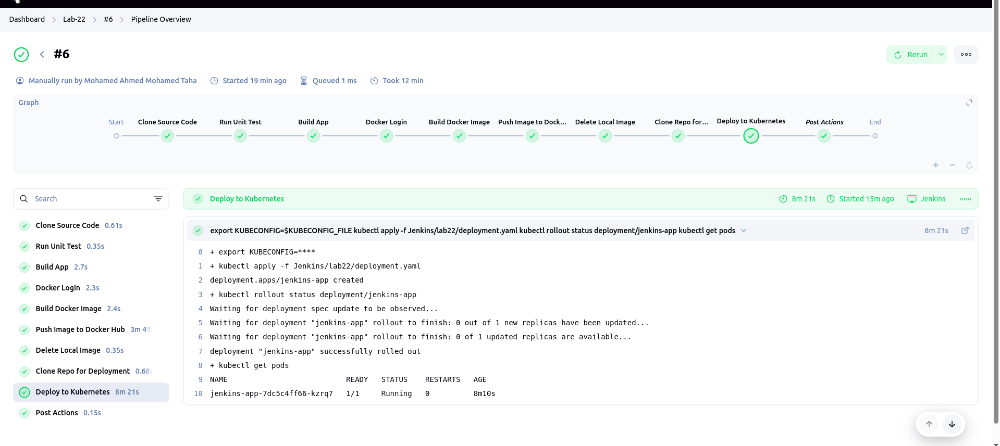
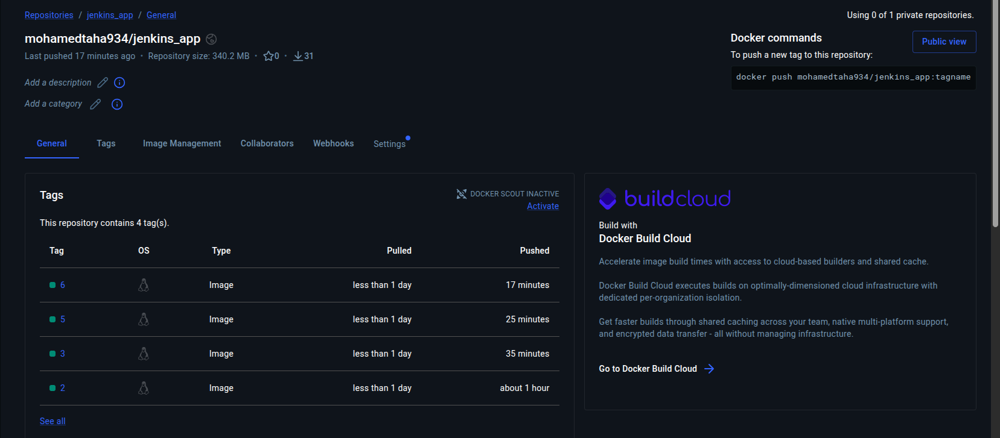
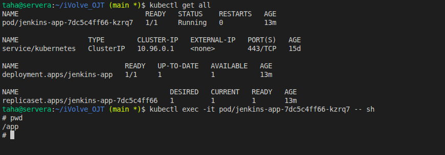

# Lab 22: Jenkins Pipeline for Application Deployment

## Table of Contents

* [Overview](#overview)
* [Prerequisites](#prerequisites)
* [Pipeline Stages](#pipeline-stages)
* [Setting Up Credentials](#setting-up-credentials)
* [Screenshots](#screenshots)
* [Notes](#notes)

---

## Overview

This lab creates a Jenkins pipeline that automates:

1. Cloning source code from GitHub.
2. Running unit tests.
3. Building the application using Maven.
4. Building and pushing a Docker image to Docker Hub.
5. Deploying the Docker image to a Kubernetes cluster.

All sensitive operations (Docker login, kubectl) use Jenkins credentials for security.

---

## Prerequisites

* Jenkins installed and running.
* Docker installed on Jenkins agent.
* Minikube cluster running locally.
* Docker Hub account.
* GitHub repository with application code and Dockerfile.

---

## Pipeline Stages

```groovy
pipeline {
    agent any

    environment {
        IMAGE_NAME = "mohamedtaha934/jenkins_app"
        IMAGE_TAG  = "${BUILD_NUMBER}"
    }

    stages {

        stage('Clone Source Code') {
            steps {
                git url: 'https://github.com/Ibrahim-Adel15/Jenkins_App.git', branch: 'main'
            }
        }

        stage('Run Unit Test') {
            steps {
                sh 'mvn test'
            }
        }

        stage('Build App') {
            steps {
                sh 'mvn clean package'
            }
        }

        stage('Docker Login') {
            steps {
                withCredentials([usernamePassword(
                    credentialsId: 'dockerhub-creds',
                    usernameVariable: 'DOCKER_USER',
                    passwordVariable: 'DOCKER_PASS'
                )]) {
                    sh 'echo $DOCKER_PASS | docker login -u $DOCKER_USER --password-stdin'
                }
            }
        }

        stage('Build Docker Image') {
            steps {
                sh 'docker build -t $IMAGE_NAME:$IMAGE_TAG .'
            }
        }

        stage('Push Image to Docker Hub') {
            steps {
                sh 'docker push $IMAGE_NAME:$IMAGE_TAG'
            }
        }

        stage('Delete Local Image') {
            steps {
                sh 'docker rmi $IMAGE_NAME:$IMAGE_TAG'
            }
        }

        stage('Deploy to Kubernetes') {
            steps {
                withCredentials([file(credentialsId: 'kubeconfig-creds', variable: 'KUBECONFIG_FILE')]) {
                    sh '''
                    export KUBECONFIG=$KUBECONFIG_FILE
                    kubectl apply -f Jenkins/lab22/deployment.yaml
                    kubectl rollout status deployment/jenkins-app
                    kubectl get pods
                    '''
                }
            }
        }
    }

    post {
        always { echo 'Pipeline finished (always)' }
        success { echo 'SUCCESS: Application deployed to Kubernetes' }
        failure { echo 'FAILED: Check pipeline logs' }
    }
}
```

---

## Setting Up Credentials

### 1. Docker Hub

1. Jenkins > Credentials > System > Global credentials.
2. Add Credentials > Kind: Username with password.
3. Username: `<your-dockerhub-username>`.
4. Password: `<your-dockerhub-password>`.
5. ID: `dockerhub-creds`.

### 2. Kubernetes (Minikube)

1. Export your kubeconfig:

```bash
# Create a folder for Jenkins kubeconfig
sudo mkdir -p /var/lib/jenkins/kube

# Copy Minikube kubeconfig files
sudo cp $HOME/.minikube/profiles/<cluster-name>/* /var/lib/jenkins/kube/

# Change ownership to Jenkins user
sudo chown -R jenkins:jenkins /var/lib/jenkins/kube

# Set safe permissions
sudo chmod 644 /var/lib/jenkins/kube/*
```
*Note: replace <cluster-name> with minikube current running profile.*

2. Jenkins > Credentials > System > Global credentials.
3. Add Credentials > Kind: Secret file.
4. Upload the main kubeconfig file from `/var/lib/jenkins/kube/config`.
5. ID: `kubeconfig-creds`.

---

## Screenshots


*Jenkins pipeline stages view.*


*Docker image pushed to Docker Hub.*


*Pods running in Minikube cluster.*

---

## Aurther
**Mohamed Ahmed Mohamed Taha.**