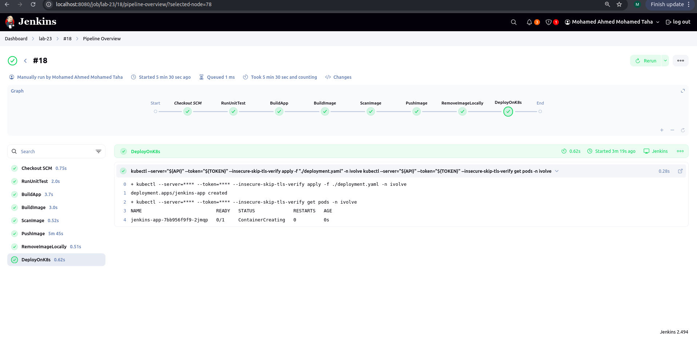

# Lab 23 – Complete CI/CD Pipeline with Jenkins, Docker, Maven & Kubernetes (Minikube)

## Objective

Build a full end-to-end CI/CD pipeline using Jenkins that:

* Runs unit tests on a Maven Java application
* Builds the JAR
* Creates & scans a Docker image
* Deploys the application to Minikube using a **shared library**

---

## Repositories Used

| Repository                                                                                                         | Purpose                                                | Branch |
| ------------------------------------------------------------------------------------------------------------------ | ------------------------------------------------------ | ------ |
| [https://github.com/MohamedAhmmedTaha/iVolve_OJT](https://github.com/MohamedAhmmedTaha/iVolve_OJT)                 | Main lab files (Jenkinsfile, yaml manifests, app code) | main   |
| [https://github.com/MohamedAhmmedTaha/jenkins-shared-lib](https://github.com/MohamedAhmmedTaha/jenkins-shared-lib) | Reusable Jenkins pipeline steps (vars/)                | main   |

---

## Architecture Overview

1. Jenkins clones the repo → runs Maven unit tests & builds the Java JAR
2. Builds a Docker image → tags with Jenkins build number
3. Scans image using Trivy (or similar, implemented in shared library)
4. Deploys to Minikube using custom `deployOnK8s` step:

   * Authenticates with `--server` + `--token`
   * Targets namespace `ivolve`

---

## Prerequisites

* Minikube running (single-node cluster)
* kubectl installed and configured to communicate with Minikube
* Jenkins server/agent with:

  * Docker installed (for building images)
  * Maven installed (for building Java app)
  * kubectl installed (used in `deployOnK8s`)
* GitHub account with read access to both repositories

---

## Step 1 – Minikube & Kubernetes Setup

```bash
# Start Minikube (choose driver for your machine)
minikube start --driver=docker

# Get Minikube API server URL
minikube ip

# Create namespace
kubectl create namespace ivolve

# Apply RBAC files
cd Jenkins/lab23
kubectl apply -f jenkins-sa.yaml
kubectl apply -f jenkins-deployment-role.yaml
kubectl apply -f jenkins-deployment-rolebinding.yaml
```

---

## Step 2 – Configure Jenkins Credentials

1. **Docker Hub credentials**:

   * Jenkins → Manage Jenkins → Credentials → Global → Add Credentials
   * Kind: Username with password
   * ID: `dockerhub-creds`
   * Use in pipeline with `withCredentials([usernamePassword(...)])`

2. **Kubernetes cluster API & token**:

   * Jenkins → Manage Jenkins → Credentials → Global → Add Credentials
   * Kind: Secret text
   * ID: `API-SERVER` → value: `https://<minikube-ip>:8443`
   * ID: `Jenkins-Token` → value: token from service account
   * Minikube API token can be obtained via:
```bash
kubectl  get secret jenkins-sa-token -n ivolve -o jsonpath="{.data.token}" | base64 -d
```

3. **Shared library**:

   * Jenkins → Manage Jenkins → Configure System → Global Pipeline Libraries
   * Name: `shared-lib`
   * SCM: Git
   * Repository: `https://github.com/MohamedAhmmedTaha/jenkins-shared-lib`
   * Default version: `main`

---

## Step 3 – Jenkins Pipeline Setup

1. Create a new pipeline job:

   * Definition: Pipeline script from SCM
   * SCM: Git → Repository URL: `https://github.com/MohamedAhmmedTaha/iVolve_OJT.git`
   * Branch: `main`
   * Script Path: `Jenkins/lab23/Jenkinsfile`
   * Lightweight checkout: ✅

2. Pipeline stages:

```groovy
@Library('shared-lib') _

pipeline {
    agent any

    environment {
        IMAGE_NAME = "mohamedtaha934/jenkins_app"
        IMAGE_TAG  = "${BUILD_NUMBER}"
    }

    stages {

        stage('RunUnitTest') {
            steps {
                dir('Jenkins/lab23') {
                    runUnitTest()
                }
            }
        }

        stage('BuildApp') {
            steps {
                dir('Jenkins/lab23') {
                    buildApp()
                }
            }
        }

        stage('BuildImage') {
            steps {
                dir('Jenkins/lab23') {
                    buildImage(IMAGE_NAME, IMAGE_TAG)
                }
            }
        }

        stage('ScanImage') {
            steps {
                dir('Jenkins/lab23') {
                    scanImage(IMAGE_NAME, IMAGE_TAG)
                }
            }
        }

        stage('PushImage') {
            steps {
                dir('Jenkins/lab23') {
                    pushImage(IMAGE_NAME, IMAGE_TAG)
                }
            }
        }

        stage('RemoveImageLocally') {
            steps {
                dir('Jenkins/lab23') {
                    removeImage(IMAGE_NAME, IMAGE_TAG)
                }
            }
        }

        stage('DeployOnK8s') {
            steps {
                dir('Jenkins/lab23') {
                    deployOnK8s('./deployment.yaml')
                }
            }
        }
    }
}

```

---

## Step 4 – Run the Pipeline

1. Trigger a build → Jenkins will:

   * Clone repo → build app with Maven
   * Build Docker image → scan → push to Docker Hub
   * Deploy to Minikube using `kubectl apply -f deployment.yaml`

2. Verify deployment:

```bash
kubectl get pods -n ivolve
kubectl get deployments -n ivolve
```

---

## Screenshots


*Jenkins pipeline stages view.*


---


## Notes

* Always make sure credentials IDs in `deployOnK8s.groovy` match the Jenkins credentials
* Shared library simplifies pipeline stages → reuse in other projects

---
## Aurther
**Mohamed Ahmed Mohamed Taha.**
