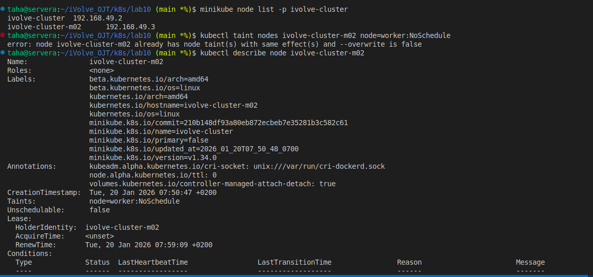

# Lab 10: Node Isolation Using Taints in Kubernetes

## Objective
- Run a Kubernetes cluster with multiple nodes
- Apply a taint to a worker node
- Verify node taints

---

## Steps

### 1. Start Minikube with 2 Nodes
```bash
minikube start -p ivolve-cluster --nodes 2
```

### 2. Verify Nodes
```bash
kubectl get nodes
```

### 3. Apply Taint to Worker Node
```bash
kubectl taint nodes ivolve-cluster-m02 node=worker:NoSchedule
```

### 4. Verify Taint
```bash
kubectl describe node ivolve-cluster-m02
```

---

>## Screenshot (Lab10 Execution Result)



---

## Notes
- `NoSchedule` prevents new pods from being scheduled
- Only pods with tolerations can run on this node

---

## Author:
 Mohamed Ahmed Mohamed Taha
