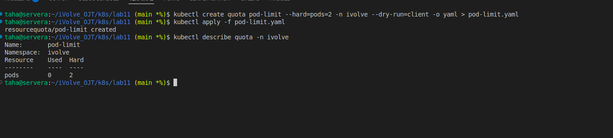

# Lab 11: Namespace Management and Resource Quota Enforcement

## Objective
- Create a namespace
- Apply a resource quota to limit pods

---

## Steps

### 1. Create Namespace
```bash
kubectl create namespace ivolve
```

### 2. Create ResourceQuota YAML
```yaml
apiVersion: v1
kind: ResourceQuota
metadata:
  name: pod-limit
  namespace: ivolve
spec:
  hard:
    pods: "2"
```
or 
```bash
 kubectl create quota pod-limit --hard=pods=2 -n ivolve --dry-run=client -o yaml > pod-limit.yaml
```
### 3. Apply ResourceQuota
```bash
kubectl apply -f pod-quota.yaml
```

### 4. Verify Quota
```bash
kubectl describe quota -n ivolve
```

---

>## Screenshot (Lab11 Execution Result)



---

## Notes
- ResourceQuota restricts resource usage per namespace
- Commonly used in multi-team clusters

---

## Author: 
Mohamed Ahmed Mohamed Taha
