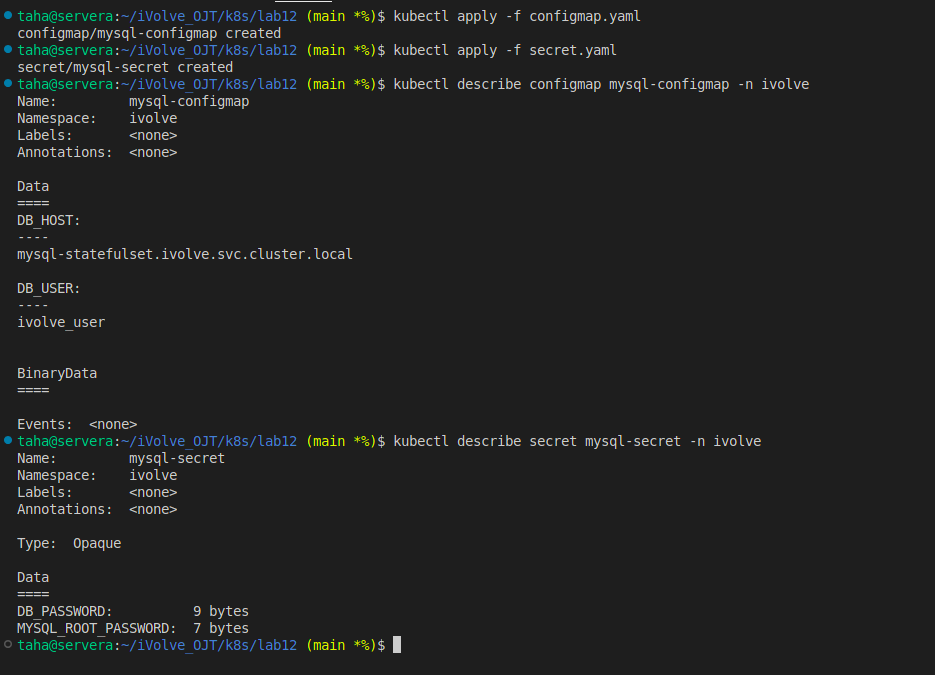

# Lab 12: Managing Configuration and Sensitive Data with ConfigMaps and Secrets

## Objective
- Use ConfigMaps for non-sensitive configuration
- Use Secrets for sensitive data
- Apply base64 encoding for secrets

---

## ConfigMap

### mysql-configmap.yaml
```yaml
apiVersion: v1
kind: ConfigMap
metadata:
  name: mysql-config
  namespace: ivolve
data:
  DB_HOST: mysql-statefulset.ivolve.svc.cluster.local
  DB_USER: ivolve_user
```

Apply:
```bash
kubectl apply -f mysql-configmap.yaml
```

---

## Secret

### Base64 Encode Values
```bash
echo -n ivolve123 | base64
echo -n root123 | base64
```

### mysql-secret.yaml
```yaml
apiVersion: v1
kind: Secret
metadata:
  name: mysql-secret
  namespace: ivolve
type: Opaque
data:
  DB_PASSWORD: aXZvbHZlMTIz
  MYSQL_ROOT_PASSWORD: cm9vdDEyMw==
```

Apply:
```bash
kubectl apply -f mysql-secret.yaml
```

---


>## Screenshot (Lab12 Execution Result)



---

## Notes
- Secrets are base64 encoded, not encrypted
- Kubernetes decodes secrets at runtime

---

## Author:
 Mohamed Ahmed Mohamed Taha
