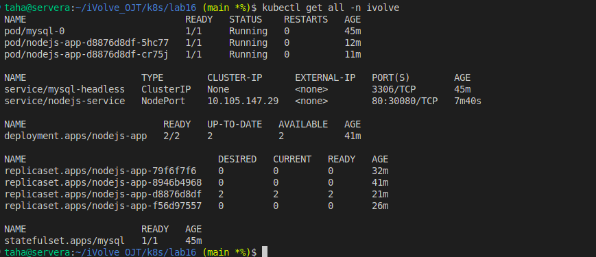
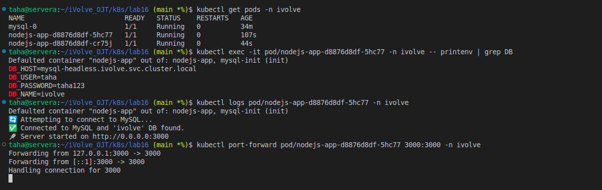
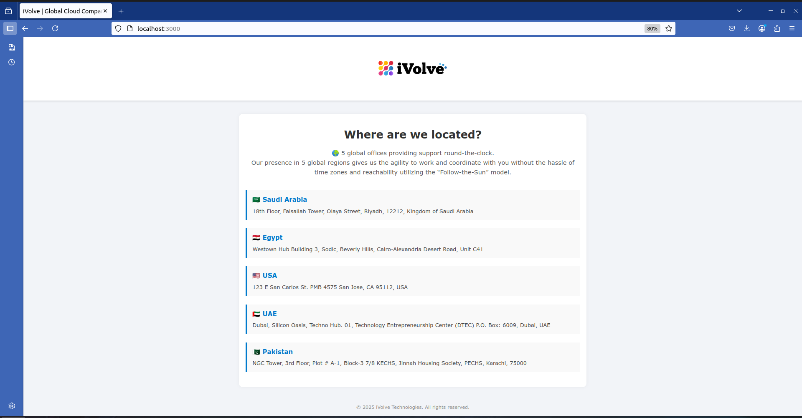
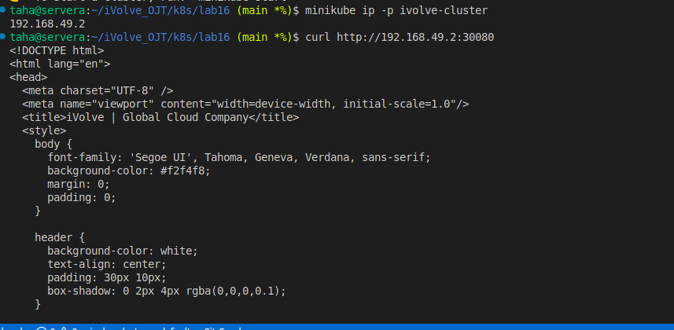

# iVolve OJT Kubernetes Labs Project

## Overview

This project contains multiple Kubernetes labs (lab12 - lab16) demonstrating various concepts including ConfigMaps, Secrets, StatefulSets, Deployments, PersistentVolumes, and Services. Each lab folder contains relevant YAML files and assets. The Node.js application with MySQL database is the main application tested across the labs.

---

## Lab Details

### Lab 12

* **Files:**

  * `configmap.yaml` → Defines ConfigMaps for environment variables.
  * `secret.yaml` → Defines Secrets for sensitive data (DB credentials).
  * `README.md` → Lab documentation.
  * `lab12.png` → Visual diagram of the lab setup.

**Purpose:** Introduce ConfigMaps and Secrets.

### Lab 13

* **Files:**

  * `app-pv.yaml` → PersistentVolume configuration.
  * `app-pvc.yaml` → PersistentVolumeClaim configuration.
  * `README.md` → Lab documentation.
  * `lab13.png` → Diagram showing PV and PVC.

**Purpose:** Demonstrate PV & PVC usage for stateful applications.

### Lab 14

* **Files:**

  * `mysql-headless.yaml` → StatefulSet for MySQL with headless service.
  * `statefulset.yaml` → MySQL StatefulSet configuration.
  * `README.md` → Lab documentation.
  * `lab14.png` → Diagram showing MySQL StatefulSet.

**Purpose:** Deploy MySQL as a stateful application.

### Lab 15

* **Files:**

  * `my-app-deployment.yaml` → Node.js Deployment.
  * `lab15.png` → Diagram of Node.js app deployment.

**Purpose:** Deploy Node.js application connected to MySQL.

### Lab 16

* **Files:**

  * `nodjs-deployment.yaml` → Node.js Deployment with init container (creates DB, user, and grants privileges).
  * `nodjs-np-svc.yaml` → Node.js NodePort to expose at port **30080** Service configuration.

**Purpose:** Integrate Node.js app with MySQL using proper DB credentials and PVC storage.

**Bonus:** Node.js Service exposes port **3000**. This is the bonus requirement mentioned by the instructor.

---

## How to Run the Project

1. **Clone the repository**

   ```bash
   git clone <repo-url>
   cd <repo-folder>
   ```

2. **Apply Secrets and ConfigMaps (Lab12)**

   ```bash
   kubectl apply -f lab12/secret.yaml -n ivolve
   kubectl apply -f lab12/configmap.yaml -n ivolve
   ```

3. **Apply PV and PVC (Lab13)**

   ```bash
   kubectl apply -f lab13/app-pv.yaml -n ivolve
   kubectl apply -f lab13/app-pvc.yaml -n ivolve
   ```

4. **Deploy MySQL (Lab14)**

   ```bash
   kubectl apply -f lab14/mysql-headless.yaml -n ivolve
   kubectl apply -f lab14/statefulset.yaml -n ivolve
   ```

5. **Deploy Node.js app (Lab15 & Lab16)**

   ```bash
   kubectl apply -f lab15/my-app-deployment.yaml -n ivolve
   kubectl apply -f lab16/nodjs-deployment.yaml -n ivolve
   kubectl apply -f lab16/nodjs-np-svc.yaml -n ivolve
   ```

6. **Check pods and services**

   ```bash
   kubectl get all -n ivolve
   ```

7. **Access Node.js app (Bonus)**

   * Forward port 3000 to localhost:

     ```bash
     minikube ip -p <cluster-name>
     curl http://<minikube-cluster-ip>:30080

     ```
   * Open your browser at: `http://localhost:3000`

---   
>## Screenshot (Lab16 Execution Result)


>### Bonus:using port forwarding

>### Bonus:using NpdePort Service



---
## Notes

* Ensure all secrets and ConfigMaps are correctly applied before deploying applications.
* Init container in Node.js deployment creates DB and user before the app starts.
* PVCs must be bound to volumes before Node.js pods start.
* The bonus part is the Node.js Service exposing port 3000 for testing the app.
---
## Author

Mohamed Ahmed Mohamed Taha