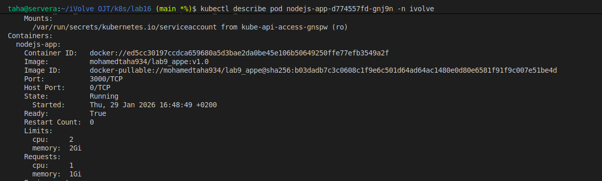
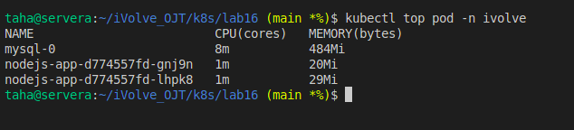

# Lab 17: Pod Resource Management (CPU & Memory)

## Overview
After completing **Lab 16**, where we successfully deployed the Node.js application with MySQL using StatefulSet and Deployment,  
this lab focuses on **resource management** in Kubernetes.

In this lab, we enhance the existing **Node.js Deployment** by defining **CPU and Memory requests and limits** to control resource usage and ensure cluster stability.

---

## Lab Objectives
- Add **resource requests** and **limits** to the Node.js application pod.
- Verify the applied resources using `kubectl describe pod`.
- Monitor real-time resource usage using `kubectl top pod`.
- Enable `metrics-server` if metrics are not available.

---

## pdated Deployment Configuration

### Resource Configuration Added
```yaml
resources:
  requests:
    cpu: "1"
    memory: "1Gi"
  limits:
    cpu: "2"
    memory: "2Gi"
```

---

##  Steps to Apply Changes

### 1.Update the Node.js Deployment
Edit the existing deployment:
```bash
kubectl edit deployment nodejs-app -n ivolve
```

Add the resource section under the container spec.

---

### 2.Apply and Verify Pod Recreation
```bash
kubectl get pods -n ivolve
```

Ensure new pods are created with the updated configuration.

---

##  Verification Steps

### Verify Requests & Limits
```bash
kubectl describe pod <pod-name> -n ivolve
```

Look for:
```
Requests:
  cpu:     1
  memory:  1Gi
Limits:
  cpu:     2
  memory:  2Gi
```

---

### Monitor Resource Usage
```bash
kubectl top pod -n ivolve
```

---

## Metrics API Activation

If you see:
```
error: Metrics API not available
```

### Enable metrics-server:
```bash
minikube addons enable metrics-server
```

Wait 30–60 seconds, then verify:
```bash
kubectl get pods -n kube-system | grep metrics
```

Retry:
```bash
kubectl top pod -n ivolve
```

---
>## Screenshot (Lab17 Execution Result)



---
## Author
Mohamed Ahmed Mohamed Taha


