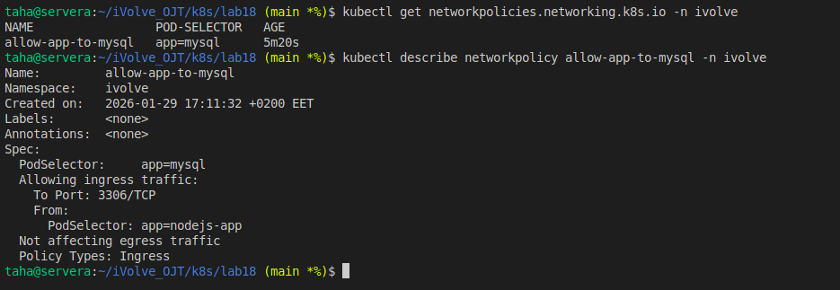

# Lab 18: Control Pod-to-Pod Traffic via NetworkPolicy

##  Overview
In this lab, we secure communication inside the Kubernetes cluster by controlling **pod-to-pod traffic** using a **NetworkPolicy**.

The goal is to:
- Allow **only the Node.js application pods** to communicate with **MySQL pods**
- Block any other pod from accessing MySQL
- Restrict access strictly to **MySQL port 3306**

---

##  Lab Objectives
- Create a NetworkPolicy named `allow-app-to-mysql`
- Apply **Ingress-only** rules
- Target MySQL pods using labels
- Allow traffic **only from application pods**
- Restrict traffic to **port 3306**

---

## Prerequisites
- Kubernetes cluster (Minikube)
- CNI plugin that supports NetworkPolicy (e.g. Calico)
- Existing deployment:
  - Node.js app pods with label `app=nodejs-app`
  - MySQL pods with label `app=mysql`
- Namespace: `ivolve`

---

## NetworkPolicy Definition

###  File: `app-network-policy.yaml`

```yaml
apiVersion: networking.k8s.io/v1
kind: NetworkPolicy
metadata:
  name: allow-app-to-mysql
  namespace: ivolve
spec:
  podSelector:
    matchLabels:
      app: mysql
  policyTypes:
  - Ingress
  ingress:
  - from:
    - podSelector:
        matchLabels:
          app: nodejs-app
    ports:
    - protocol: TCP
      port: 3306
```

---

##  Apply the NetworkPolicy

```bash
kubectl apply -f allow-app-to-mysql.yaml
```

---

## Verification Steps

```bash
kubectl get networkpolicy -n ivolve
```

Expected output:
```
NAME                 POD-SELECTOR   AGE
allow-app-to-mysql   app=mysql      Xs
```

```bash
kubectl describe networkpolicy allow-app-to-mysql -n ivolve
```
---
>## Screenshot (Lab18 Execution Result)



---
## Author
Mohamed Ahmed Mohamed Taha

