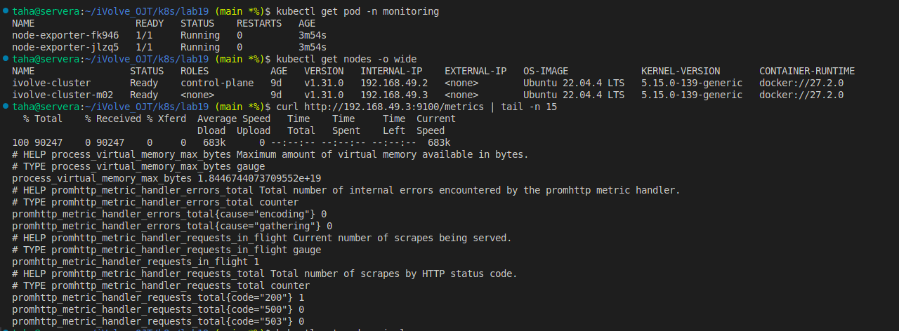
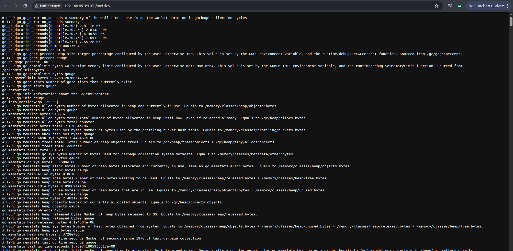

# Lab 19: Node-Wide Pod Management with DaemonSet

## Objective
This lab demonstrates how to use a DaemonSet to ensure that a specific Pod runs on every node in the Kubernetes cluster. We deploy Prometheus node-exporter for node-level monitoring.

## Steps

### 1. Create monitoring namespace
```bash
kubectl create namespace monitoring
```
### 2. Deploy node-exporter as a DaemonSet
A DaemonSet is used because:
- It guarantees one Pod per node.
- It is ideal for monitoring, logging, and security agents.

Key configurations:
- hostNetwork: true (allows access to node network)
- tolerations: allow scheduling on tainted nodes
- container exposes port 9100 for metrics
```bash
apiVersion: apps/v1
kind: DaemonSet
metadata:
  name: node-exporter
  namespace: monitoring
spec:
  selector:
    matchLabels:
      app: node-exporter
  template:
    metadata:
      labels:
        app: node-exporter
    spec:
      tolerations:
        - operator: "Exists"
      containers:
        - name: node-exporter
          image: prom/node-exporter:latest
          ports:
            - containerPort: 9100
              hostPort: 9100
              name: metrics
```
### 3. Validate DaemonSet Pods
```bash
kubectl get pods -n monitoring -o wide
```
Ensure one pod is running on each node.

### 4. Verify Metrics Exposure
Access metrics from any node:
```bash
http://<NODE_IP>:9100/metrics
```
---
>## Screenshot (Lab19 Execution Result)



---
## Author
Mohamed Ahmed Mohamed Taha
